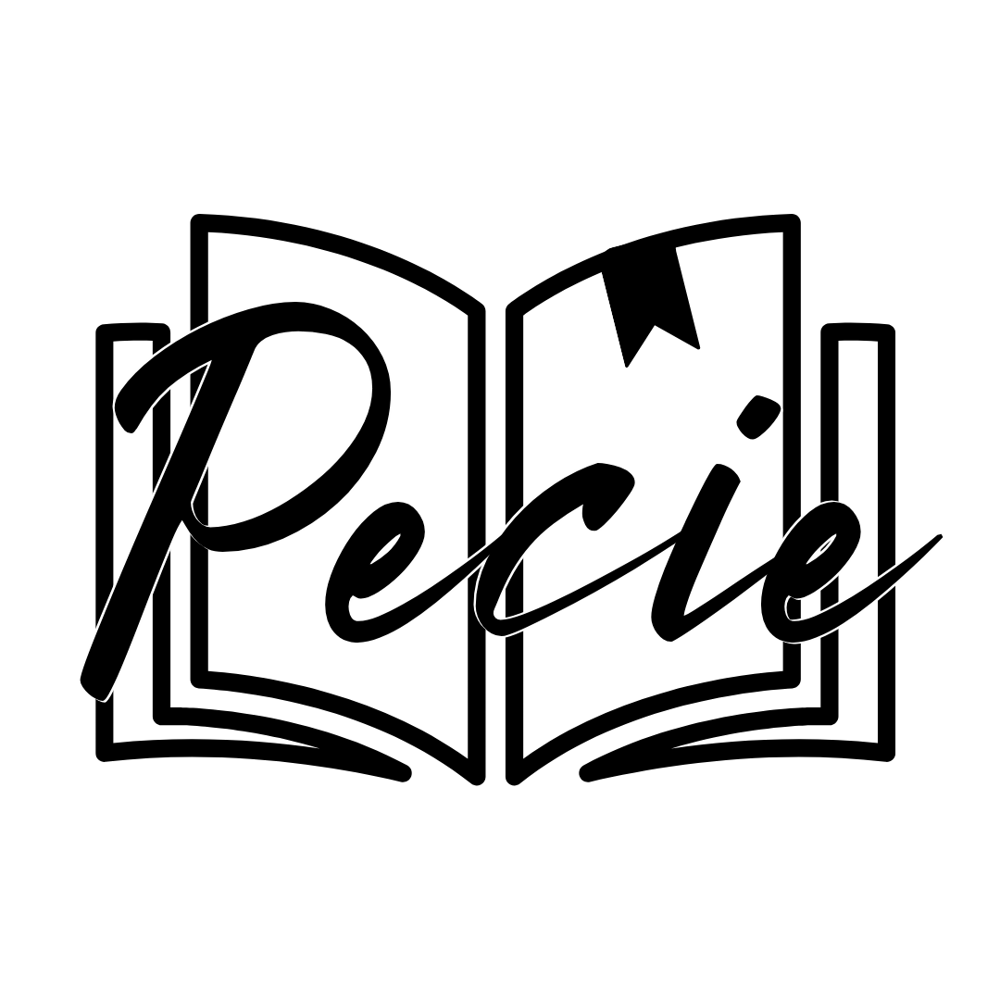

# Pecie

Pecie is a local-first editorial studio for long-form writing, structured documents, and technical documentation.

It is built as a desktop application with Electron, React, and TypeScript, and it is designed around a simple premise:

**Pecie stores projects, not just files.**

## Product Scope

Pecie is for people who work on substantial writing projects and need structure, continuity, and calm:

- theses and dissertations
- papers and articles
- books and essays
- manuals and technical documentation
- custom editorial projects built from a blank template

It is intentionally:

- local-first
- file-based and portable
- accessible by design
- structured around projects, not isolated documents
- easy to use

## What Is Included

The current version includes the following product surface.

### Project Creation and Launch Flow

- first-run setup with local workspace selection
- persistent local author profile
- create-first launcher
- recent projects
- project archive, restore, and delete flow
- settings for workspace, author profile, UI language, and theme
- product info and integrated guidance

### Editorial Templates

Pecie currently ships with these starter templates:

- Blank project
- Thesis
- Paper
- Book / Essay
- Manual

Each template includes a coherent starting structure plus a writing hub for local support material.

### Workspace

- binder-based project navigation
- Markdown editor for long-form writing
- write, preview, and split view modes
- focus mode and typewriter mode
- assisted formatting toolbar
- document word count and session feedback
- integrated workspace guide center
- global project search

### Writing Hub and Local Support Material

- project notes
- scratchpad documents
- source/reference containers
- local attachments
- support notes that can be absorbed into writing documents

### Local Image Insertion

- image insertion from the toolbar
- local image picker with lightweight validation
- alt text input
- image copy into the project package
- portable relative Markdown references
- internal asset registry for project-managed images
- preview/export path resolution for internal project images

### Export

The exact availability of formats depends on the local export toolchain, but the implemented workflow is built around a Pandoc-based export pipeline.

### Localization

The UI is localized in:

- Italian
- English
- German
- Spanish
- French
- Portuguese

### Packaging and Release

The repository is prepared for desktop packaging on:

- Linux
- Windows
- macOS

GitHub Actions release packaging is also configured.

## Not Included Yet

The following areas are not part of the current product:

- project timeline and checkpoint/milestone history UI
- citation and bibliography workflows
- advanced academic research workspace beyond the current local support model
- share packages with history exchange
- plugin system

## Core Principles

Pecie follows a few non-negotiable design and engineering principles:

- **Local-first**: core work happens on the user’s machine.
- **Portable output**: the project should remain inspectable and movable.
- **Structured writing**: the binder and project model matter as much as the editor.
- **Recoverability over cleverness**: simple files, explicit contracts, safe data handling.
- **Accessibility by design**: keyboard navigation, visible focus, and readable UI are part of the product.
- **Security by default**: typed IPC, isolated renderer, restricted desktop surface.

## Project Format

Pecie uses a native `.pe` project format.

The project model is schema-driven and built around canonical project files plus local content and assets.

At a high level, a Pecie project contains:

- manifest metadata
- project metadata
- binder structure
- Markdown content documents
- local support notes
- local attachments
- internal media assets for inline images

This format is designed to keep the project portable across machines as long as the `.pe` package is moved as a whole.

## Repository Layout

```text
apps/
  desktop/          Electron desktop application
packages/
  application/      application services and contracts
  domain/           project templates and domain logic
  infrastructure/   IPC, filesystem, export, shell integration
  schemas/          JSON schemas and generated shared types
  ui/               shared UI components
scripts/            project tooling such as type generation
```

## Tech Stack

- Electron
- React
- TypeScript
- Vite
- SQLite for derived/local indexing concerns
- JSON schemas with generated TypeScript types
- local desktop packaging with Electron Forge and Electron Builder

## Requirements

- Node.js 20
- npm 10+

## Install

```bash
npm ci
```

The repository uses npm workspaces and a shallow install strategy so runtime dependencies remain compatible with Electron Forge packaging in the desktop workspace.

## Development

Run the desktop app in development mode:

```bash
npm run dev
```

## Validation

Run the standard validation flow:

```bash
npm run generate:types
npm run lint
npm run typecheck
npm run test:unit
```

## Local Packaging

Unified Linux release flow:

```bash
npm run make:desktop:linux:release
```

Linux `.deb` and `.snap`:

```bash
npm run make:linux -w @pecie/desktop
```

Linux `.AppImage`:

```bash
npm run make:linux:appimage -w @pecie/desktop
```

Windows installer:

```bash
npm run make:win -w @pecie/desktop
```

macOS packages:

```bash
npm run make:mac -w @pecie/desktop
```

Generated artifacts are written to:

- `apps/desktop/out/make/`
- `apps/desktop/out/appimage/`

### Packaging Notes

- Final desktop packages are self-contained from the end-user perspective.
- `AppImage` is the closest Linux format to a standalone portable build.
- `.deb` is a system package format and should not be treated as a single-file portable artifact.
- Local packaging uses a runtime-link preparation step so Electron Forge can resolve workspace dependencies reliably in a monorepo.
- A first packaging run may still require network access if Electron packaging artifacts are not already present in the local cache.

## GitHub Actions Release

The release workflow is defined in [`.github/workflows/build.yml`](./.github/workflows/build.yml).

It:

- validates the repository on Ubuntu
- builds release artifacts on Linux, Windows, and macOS
- uploads packaged artifacts
- publishes a GitHub Release when a tag matching `v*` is pushed

Typical release flow:

```bash
git tag v0.1.0
git push origin v0.1.0
```

## Development Notes

- The source of truth for shared generated types is `scripts/generate-types.mjs`.
- The desktop application lives in `apps/desktop`.
- The repository is structured as a monorepo with workspaces.
- Product and planning documents may describe broader goals than the functionality currently implemented in code.

## License

Pecie is released under **AGPL-3.0-only**.

## Copyright

© Lorenzo De Marco (Lorenzo DM) - 2026
